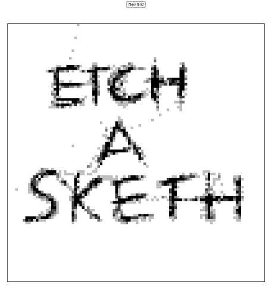

# Etch-a-Sketch Web Game

Simple etch-a-sketch game with customizable grid using HTML, CSS, JavaScript

## Instructions

<ol>
<li>Clone Repository or download code as zip</li>
<li>Open index.html file</li>
<li>Click new grid button and enter number between 16 and 100</li>
<li>Mouse over grid area to begin drawing! (going over the same area makes it darker)</li>
</ol>

